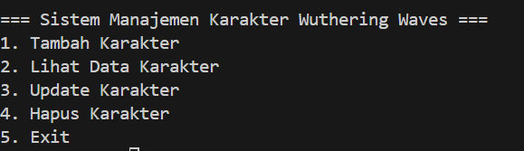
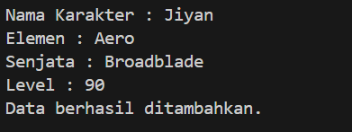
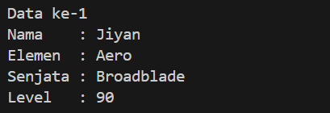
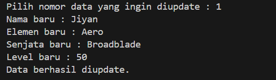
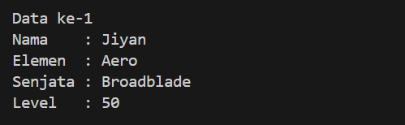
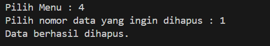
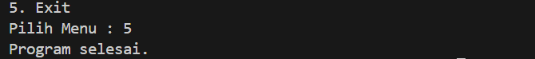
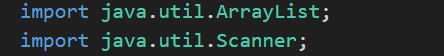
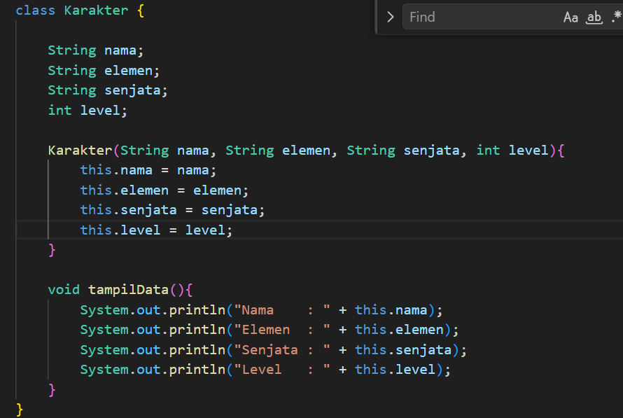
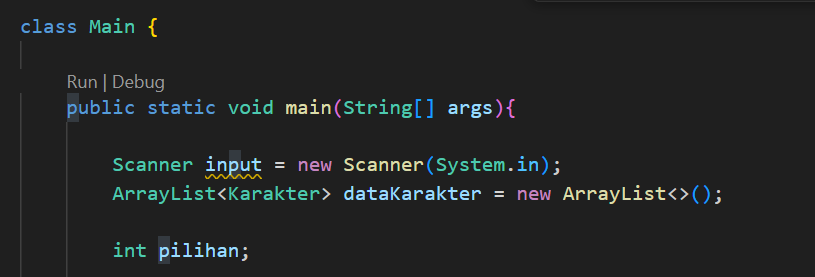

LAPORAN POSTTEST 1 - Sistem Manajemen Karakter Wuthering Waves

1. Identitas

* Nama: Melchi Simangunsong
* NIM: (2409106117)
* Sistem: Manajemen Data Karakter Wuthering Waves

---

2. Rincian Program

Program ini merupakan aplikasi sederhana yang dibuat menggunakan bahasa pemrograman Java untuk mengelola data karakter pada game Wuthering Waves.

Fokus utama pada posttest ini adalah mengimplementasikan operasi **CRUD (Create, Read, Update, Delete)** untuk mengelola data secara dinamis.

Program ini menggunakan **ArrayList** sebagai media penyimpanan data karakter dari class `Karakter`. Dengan menerapkan konsep **Object-Oriented Programming (OOP)**, setiap data karakter direpresentasikan sebagai sebuah objek yang memiliki atribut dan method sehingga pengelolaan data menjadi lebih terstruktur dan mudah dikembangkan.

---

3. Fitur Utama

- **Tambah Karakter**
   Menambahkan data karakter baru ke dalam daftar.

- **Lihat Data Karakter**
   Menampilkan seluruh data karakter yang tersimpan.

- **Update Karakter**
   Mengubah data karakter yang sudah ada.

- **Hapus Karakter**
   Menghapus data karakter dari daftar.

- **Exit Program**
   Keluar dari program dan menghentikan sistem.

Program akan terus berjalan menggunakan **looping** sampai pengguna memilih menu exit.

---

4. Dokumentasi Output Program

* Tampilan Menu Utama
  

* Menu Tambah Karakter
  

* Menu Lihat Data Karakter
  

* Menu Update Karakter
  

* Data Setelah Diupdate
  

* Menu Hapus Karakter
  

* Keluar Program
  

---

5. Penjelasan Code

Import dan Deklarasi Class

Pada bagian ini digunakan `import` untuk mengambil library yang dibutuhkan yaitu **ArrayList** dan **Scanner**.

ArrayList digunakan untuk menyimpan data karakter secara dinamis, sedangkan Scanner digunakan untuk membaca input dari pengguna.

---

 Switch Case

Switch case digunakan untuk mengatur alur menu CRUD. Setiap pilihan menu akan menjalankan proses yang berbeda sesuai dengan fitur yang dipilih oleh pengguna.

---

6. Class Pada Program

Pada program ini terdapat dua class utama yaitu:

Class Karakter

Class ini digunakan untuk menyimpan data karakter seperti:

* nama karakter
* elemen
* senjata
* level

Class ini juga memiliki **constructor** untuk mengisi nilai awal dari setiap objek karakter.

---

Class Main

Class Main merupakan class utama yang berisi seluruh alur program seperti menu utama, proses CRUD, serta pengelolaan data menggunakan ArrayList.

---

7. Kesimpulan

Program ini berhasil mengimplementasikan konsep dasar **Pemrograman Berorientasi Objek (OOP)** dalam bahasa Java dengan menggunakan class, object, constructor, dan ArrayList.

Dengan adanya fitur CRUD, program dapat mengelola data karakter Wuthering Waves secara dinamis sehingga memudahkan pengguna dalam menambah, melihat, mengubah, dan menghapus data karakter.
